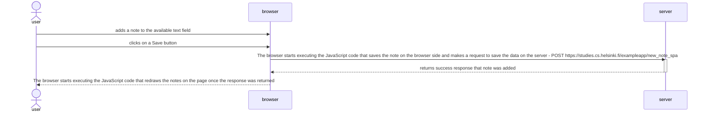

```mermaid
sequenceDiagram
    actor user
    participant browser
    participant server

    user->>browser: adds a note to the available text field
    user->>browser: clicks on a Save button

    browser->>server: The browser starts executing the JavaScript code that saves the note on the browser side and makes a request to save the data on the server - POST https://studies.cs.helsinki.fi/exampleapp/new_note_spa
    activate server
    server-->>browser: returns success response that note was added
    deactivate server

    browser-->>user: The browser starts executing the JavaScript code that redraws the notes on the page once the response was returned
```

    